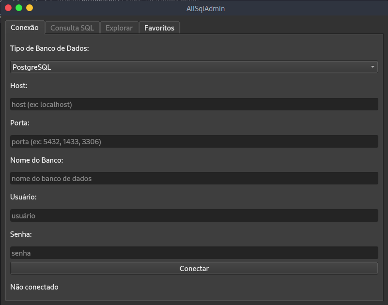

# Database GUI Tool



> Aplicação desktop para gerenciamento de bancos de dados relacionais

## 📌 Índice
- [Funcionalidades](#✨-funcionalidades)
- [Pré-requisitos](#📋-pré-requisitos)
- [Instalação](#🚀-instalação)
- [Como Usar](#🖥️-como-usar)
- [Estrutura de Arquivos](#📂-estrutura-de-arquivos)
- [Segurança](#🔒-segurança)
- [Licença](#📜-licença)

## ✨ Funcionalidades

### 🔗 Conexão com Bancos
- PostgreSQL, SQL Server e MySQL
- Validação em tempo real
- Parâmetros salvos com segurança

### 📝 Editor SQL
```sql
SELECT * FROM tabela LIMIT 10;
```

- Execução direta de queries
- Visualização em tabela dos resultados
- Feedback imediato

### 🌐 Explorador

- Lista todas as tabelas
- Pré-visualização de dados
- Atualização com um clique

### ⭐ Favoritos

- Criptografia AES-128
- Menu de contexto (botão direito)
- Conexão rápida (duplo-clique)

### 📋 Pré-requisitos

- Python 3.8+
- PIP atualizado

```bash
python --version
pip --version
```

### 🚀 Instalação

Clone o repositório:

```bash
git clone https://github.com/Felipe-M2/AllSqlAdmin
cd AllSqlAdmin
```
Ambiente virtual (recomendado):

```bash
python -m venv venv
# Linux/Mac:
source venv/bin/activate
# Windows:
.\venv\Scripts\activate
```

Instale as dependências:

```bash
pip install -r requirements.txt
```

### 🖥️ Como Usar

Execute a aplicação:
```bash
python db_gui.py
```

### 🎯 Atalhos Úteis

| Ação               | Comando       |
|--------------------|--------------|
| Conectar favorito  | Duplo-clique |
| Editar favorito    | Botão direito|
| Executar query     | Ctrl+Enter   |
| Atualizar tabelas  | F5           |

###📂 Estrutura de Arquivos
```
.
├── db_gui.py            # Código principal
├── crypto.py            # Criptografia
├── addFavorite.py       # Janela de favoritos
├── files/               # Dados da aplicação
│   ├── secret.key       # Chave de criptografia
│   └── favorites.json   # Conexões salvas
└── requirements.txt     # Dependências
```

### 🔒 Segurança

    Senhas criptografadas com AES-128

    Chave gerada automaticamente

    Armazenamento local seguro

### ⚠️ Importante: Não compartilhe o arquivo secret.key

📜 Licença

MIT License - Veja LICENSE para detalhes.

Feito com ❤️ por Felipe Marques